<h1 align="center">Online Dynamic Batching</h1>

<p align="center">
  <strong>Batch after the input pipeline knows the truth.</strong>
</p>

<p align="center">
  DataLoader-side tools for variable-length LLM and multimodal fine-tuning.
  ODB observes real training lengths after preprocessing, templates,
  tokenization, truncation, augmentation, and visual-token expansion.
</p>

<p align="center">
  <a href="https://github.com/online-dynamic-batching/online-dynamic-batching">
    
  </a>
  <a href="https://github.com/online-dynamic-batching/online-dynamic-batching/blob/main/LICENSE">
    
  </a>
  <a href="https://github.com/online-dynamic-batching/online-dynamic-batching/blob/main/pyproject.toml">
    
  </a>
  <a href="https://github.com/online-dynamic-batching/online-dynamic-batching/tree/main/docs/integration-guides">
    
  </a>
</p>

<p align="center">
  
</p>

## The Project

**Online Dynamic Batching (ODB)** forms token-budgeted batches online, at the
DataLoader/collate boundary. Short examples get larger batches, long examples
get smaller batches, and the model, optimizer, attention kernel, and dataset
format stay in place.

Most training stacks decide batch shape before the final input length is known.
ODB moves that decision to the point where the length is already observable.

| Start here | What you get |
| --- | --- |
| [`online-dynamic-batching`](https://github.com/online-dynamic-batching/online-dynamic-batching) | PyTorch package, trainer adapters, docs, tests, examples, and synthetic benchmarks |
| [Quickstart](https://github.com/online-dynamic-batching/online-dynamic-batching/blob/main/docs/quickstart.md) | Minimal install and first PyTorch loop |
| [Integration guides](https://github.com/online-dynamic-batching/online-dynamic-batching/tree/main/docs/integration-guides) | PyTorch loops, HuggingFace Trainer, LLaMA-Factory-style trainers, Accelerate, and Lightning |
| [Benchmark notes](https://github.com/online-dynamic-batching/online-dynamic-batching/blob/main/docs/benchmarks.md) | Reporting policy, public synthetic benchmark, and representative results |

## Install

```bash
pip install online-dynamic-batching
```

For HuggingFace Trainer and LLaMA-Factory-style adapters:

```bash
pip install "online-dynamic-batching[hf]"
```

## Minimal Use

```python
import odb

dataloader = odb.ODBDataLoader(
    dataset,
    token_budget=16384,
    batch_size=1,
    num_workers=4,
    prefetch_factor=64,
    collate_fn=collate_fn,
    loss_scaling="exact",
)

for batch in dataloader:
    info = odb.pop_step_info(batch, loss_scaling="exact")
    loss = model(**batch).loss * info.loss_scale
    loss.backward()
```

## Design Values

- Observe real lengths at training time instead of trusting stale length caches.
- Keep batching at the DataLoader boundary, away from model and kernel code.
- Make distributed variable work explicit with aligned grouping and step info.
- Treat loss scaling, emitted-sample accounting, and trainer stopping semantics
  as first-class integration contracts.
- Keep public validation reproducible before making production-scale claims.

## Ecosystem Shape

The main repository carries the package, documentation, examples, benchmark
notes, and agent-assisted integration skill. Supporting repositories will be
split out only when they have independent value: a docs site, a public benchmark
harness, public-data paper artifacts, or community-maintained recipes.

Apache-2.0.
